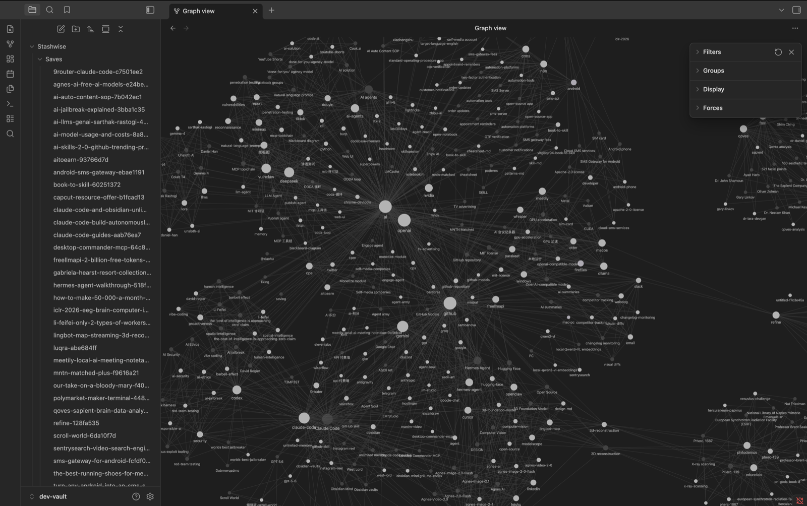
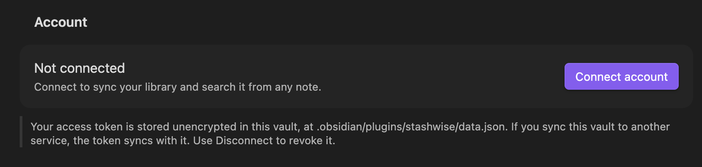
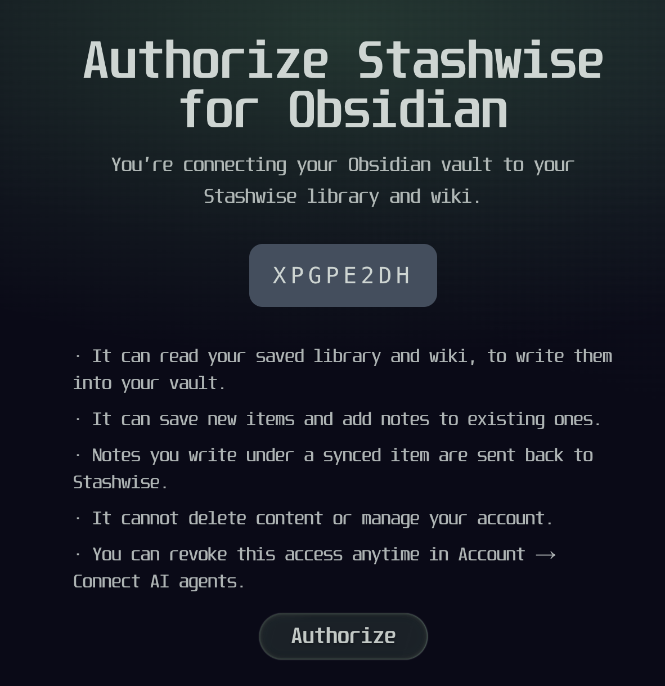
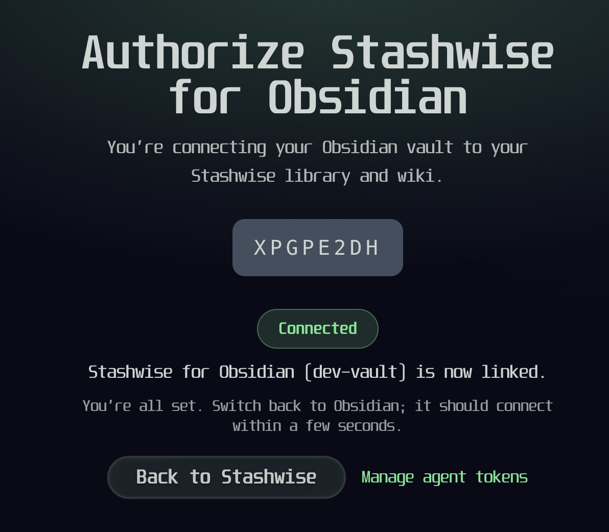
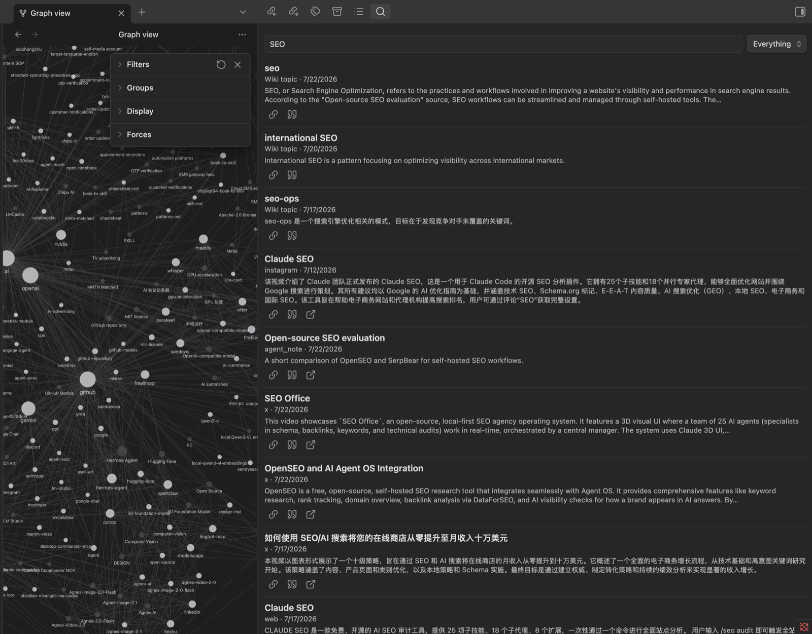
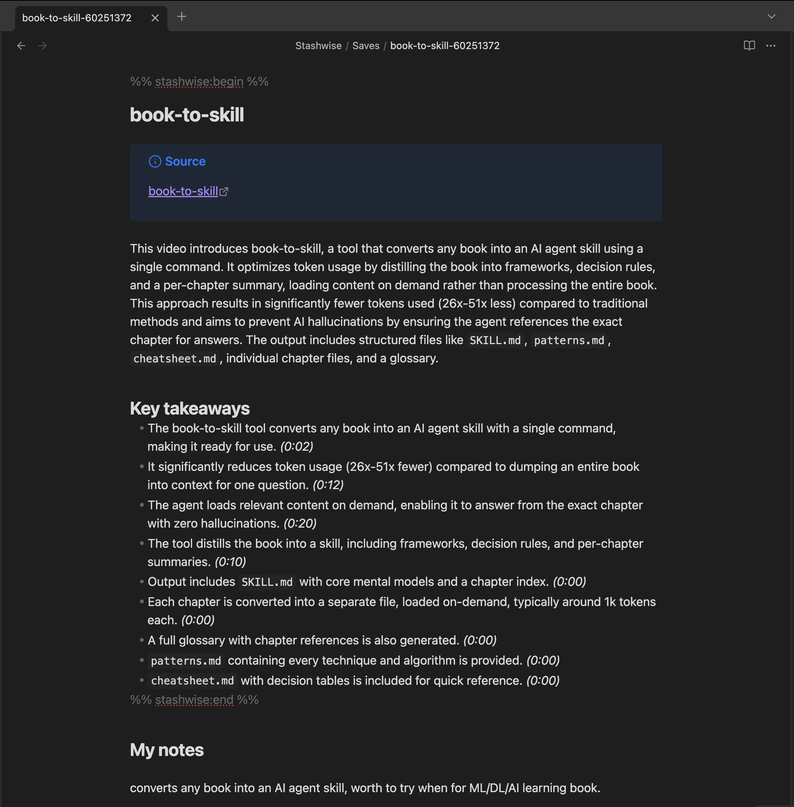
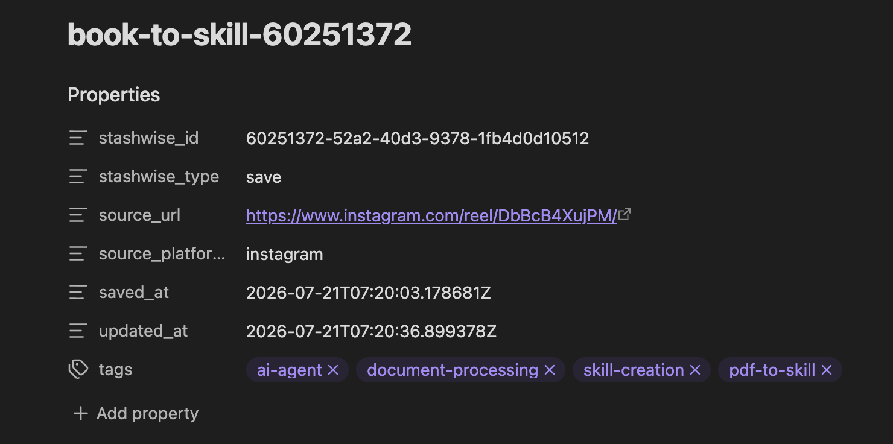

# Stashwise for Obsidian

Bring your [Stashwise](https://stashwise.co) library and wiki into your vault as
real notes, search them from anywhere in Obsidian, and send what you write back.

Stashwise saves what you find on the web, on social platforms and in video, then
reads it and builds a wiki of the topics that keep coming up. This plugin puts
that in the vault where you already think, so saved material sits beside your
own writing instead of behind another app.

It works on your phone too. Save something from any app with the Stashwise
share sheet, open Obsidian on the same phone, and the note is waiting for you.



*Your wiki topics in Obsidian's graph view, linked the way Stashwise found them.*

## Install

### From Obsidian

1. Open **Settings** with `Cmd/Ctrl + ,`
2. Go to **Community plugins** in the left sidebar
3. If you see **Restricted mode**, click **Turn on community plugins**
4. Click **Browse**
5. Search for **Stashwise**
6. Click **Install**, then **Enable**

That is it. Skip to [First run](#first-run).

### Before it reaches the directory

Stashwise is awaiting review, so it may not appear in Browse yet. Until it does,
install it with [BRAT](https://github.com/TfTHacker/obsidian42-brat), the usual
way Obsidian users run a plugin ahead of approval:

1. Install **BRAT** from Community plugins and enable it
2. Run **BRAT: Add a beta plugin for testing** from the command palette
   (`Cmd/Ctrl + P`)
3. Paste `StashwiseAI/stashwise-obsidian`
4. Choose the latest version and click **Add plugin**
5. Enable **Stashwise** under Community plugins

BRAT also keeps it updated as new versions ship.

### Manually

1. Download `main.js`, `manifest.json` and `styles.css` from the
   [latest release](https://github.com/StashwiseAI/stashwise-obsidian/releases/latest)
2. Create the folder `.obsidian/plugins/stashwise/` inside your vault
3. Put the three files in it
4. Restart Obsidian, then enable **Stashwise** under Community plugins

On mobile the `.obsidian` folder is hidden, so this is easiest with a vault you
sync from a computer.

## First run

**Connect your account.** Settings, **Stashwise**, click **Connect account**.



A browser opens, or the Stashwise app if you have it on iPhone, where you
approve the connection.





Obsidian picks it up a few seconds later; there is nothing to copy back. You
need a Stashwise account, and the free plan works.

**Sync.** It syncs on its own every 15 minutes, or run **Stashwise: Sync now**
from the command palette to start immediately. The first sync takes a moment if
your library is large.

**Look in your vault.** A `Stashwise` folder appears:

```
Stashwise/
  Saves/    one note per saved item
  Topics/   one note per wiki topic, linked to related topics
```

**Open graph view** (`Cmd/Ctrl + G`). Your topics are linked to each other, so
the graph shows the shape of what you have been reading rather than a scatter of
unconnected notes.

## Using it

**Search without leaving your note.** Click the search icon in the left ribbon
to open the Stashwise panel, or run **Stashwise: Search and insert a link** from
the command palette to search and drop a result at your cursor without touching
the mouse.



*Saves and wiki topics come back together. Each result can be inserted as a
link or a quote, or opened at its source.*

| Command | What it does |
|---|---|
| Search and insert a link | Drops `[Title](url)` at the cursor |
| Search and insert a quote | Drops a quote callout with the snippet |
| Open search panel | Opens the sidebar, also on the ribbon |
| Save current note to Stashwise | Sends this note up as a library item |
| Save URL to Stashwise | Saves a URL from your selection or the current line |
| Sync now | Pulls anything that changed |
| Full resync | Rebuilds everything, and tidies notes for deleted items |

**Write back.** Anything you type underneath a synced note is sent to Stashwise
as your note on that item, so it is there in the app and in chat too.

## On your phone

The plugin runs on Obsidian for iOS and Android, which makes a loop that is
otherwise hard to get: **capture on your phone, and it lands in your vault
without a computer involved.**

1. Share something to Stashwise from any app, a video, a post, an article
2. Stashwise reads it and writes the summary, takeaways and wiki topics
3. Open Obsidian on the same phone. It syncs when it comes to the foreground,
   and the note is there

Nothing to paste, and no laptop step in the middle. The same applies in
reverse: search your library and insert a link from the phone, and notes you
write under a synced item go back to Stashwise.

**Connecting is one tap.** Tap **Connect account** and the Stashwise app opens
directly if you have it installed, already signed in, so there is no code to
type and no signing in again in a mobile browser. Without the app you get the
same page in your browser, which works too.

Two honest caveats:

- The foreground sync respects your **Sync every** setting. At the default of 15
  minutes, opening Obsidian twice in a minute syncs once. Run **Stashwise: Sync
  now** when you want it immediately.
- Analysis takes a moment. Open Obsidian the instant you save and the note may
  read *Still being analyzed*; it fills itself in on a later sync, without you
  doing anything.

## Your writing is never overwritten

This is the promise the plugin is built around.

Each synced note has a region Stashwise owns, marked by comments that stay
invisible while reading:

```markdown
%% stashwise:begin %%
# Jukdo

Jukdo is a traditional Korean folding knife.

## Related
- [[Korean folding knife]] _(extends)_
%% stashwise:end %%

## My notes

Everything down here is yours. It is never touched.
```

Everything between the markers is refreshed on every sync. Everything below the
end marker belongs to you.



*Above the end marker is regenerated. Below it is untouched, and sent back to
Stashwise as your note on that item.*

If those markers go missing, **the plugin refuses to write to that file** and
tells you it skipped it. It will not guess where your writing begins. A note you
have to repair is recoverable; overwritten writing is not.

Each note also carries its Stashwise metadata as properties, so you can sort
and query them with Dataview or Obsidian's own search.



## Settings

| Setting | Default | What it does |
|---|---|---|
| Vault folder | `Stashwise` | Everything the plugin writes lives here. Nothing outside it is touched |
| What to sync | Saves and wiki topics | Topics are what make graph view worth opening |
| Sync every | 15 minutes | Set to `0` to sync only when you ask |
| Delete notes for removed saves | Off | See below |

**Delete notes for removed saves is off on purpose.** Deleting something in
Stashwise should not quietly remove a vault note you may have written your own
thinking underneath. Turn it on and removed items go to the system trash, where
you can still get them back.

## Your data

The plugin talks only to Stashwise. It reads nothing in your vault except the
`Stashwise` folder and any note you explicitly ask it to save.

Connecting stores an access token in `.obsidian/plugins/stashwise/data.json`,
unencrypted. That is how every Obsidian plugin holding an API key works, and it
has a consequence worth knowing: **if you sync your vault through iCloud,
Dropbox or Obsidian Sync, the token goes with it.**

**Disconnect** revokes the token on the server, not just locally, so a copy that
has travelled elsewhere stops working.

## Help

Something wrong, or an idea?
[Open an issue](https://github.com/StashwiseAI/stashwise-obsidian/issues).

Want to work on it? See [CONTRIBUTING.md](CONTRIBUTING.md).

## License

[MIT](LICENSE)
